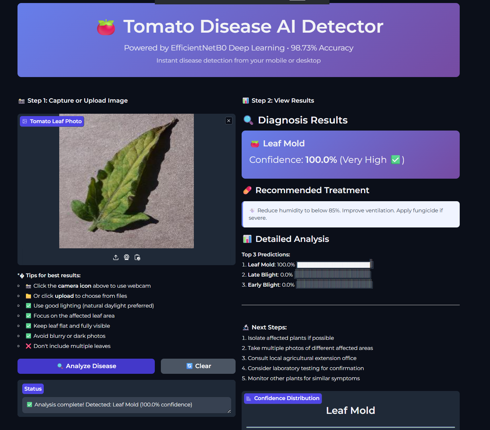
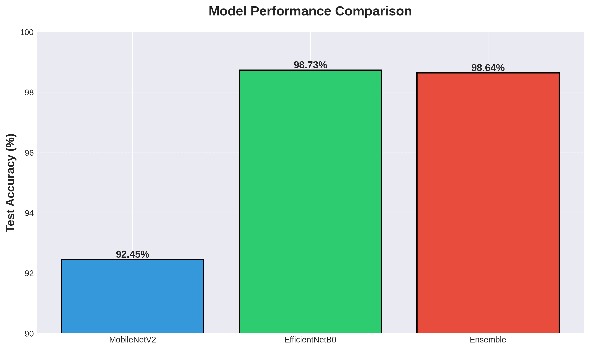
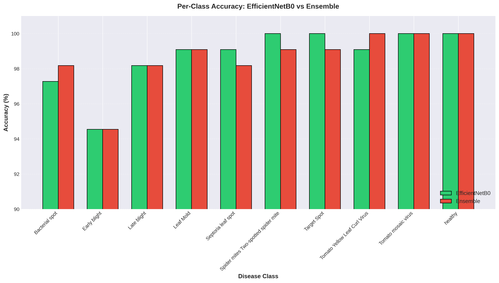
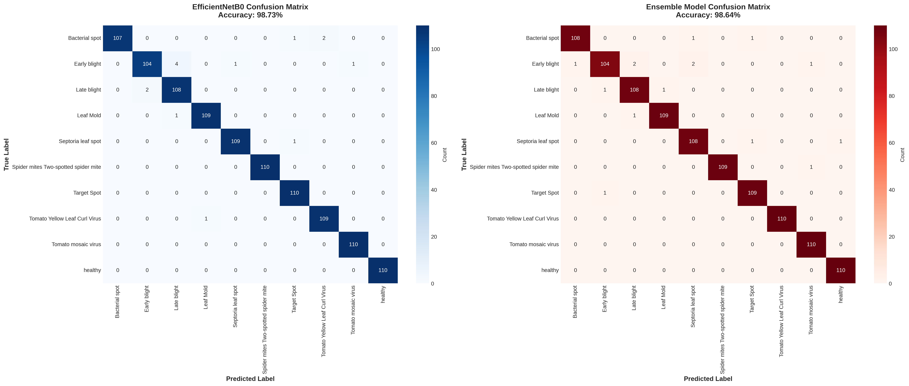

# 🍅 Tomato Leaf Disease Detection using EfficientNetB0

> **State-of-the-art deep learning model achieving 98.73% accuracy on tomato leaf disease classification**
> https://huggingface.co/spaces/syedaoon/tomato-disease-detector

[](https://www.python.org/downloads/)
[](https://tensorflow.org/)
[](https://developer.nvidia.com/cuda-toolkit)
[](LICENSE)

## 📋 Table of Contents
- [Overview](#overview)
- [Results](#results)
- [Dataset](#dataset)
- [Model Architecture](#model-architecture)
- [Installation](#installation)
- [Usage](#usage)
- [Performance Comparison](#performance-comparison)
- [Technical Details](#technical-details)
- [Future Work](#future-work)

## 🎯 Overview

This project implements a **highly accurate tomato leaf disease detection system** using transfer learning with **EfficientNetB0**. The model can identify 10 different classes of tomato plant diseases and healthy leaves with **98.73% test accuracy**.

### Key Features
- ✅ **98.73% Test Accuracy** - State-of-the-art performance on PlantVillage dataset
- ✅ **GPU-Accelerated Training** - Optimized for NVIDIA RTX 4060 with CUDA 12.9
- ✅ **Ensemble Learning** - Combined EfficientNetB0 + MobileNetV2 for robust predictions
- ✅ **Production-Ready** - Inference scripts for batch processing and real-time predictions
- ✅ **Comprehensive Metrics** - Detailed per-class performance analysis

- 
- https://huggingface.co/spaces/syedaoon/tomato-disease-detector

## 🏆 Results

### Overall Performance

| Model | Validation Accuracy | Test Accuracy | Parameters |
|-------|-------------------|---------------|------------|
| **MobileNetV2** | 95.00% | 92.45% | 3.5M |
| **EfficientNetB0** | **99.18%** | **98.73%** | 5.3M |
| **Ensemble** | 99.27% | 98.64% | 8.8M |




### Per-Class Performance

| Disease Class | EfficientNetB0 | Ensemble |
|--------------|----------------|----------|
| **Bacterial Spot** | 97.27% | 98.18% |
| **Early Blight** | 94.55% | 94.55% |
| **Late Blight** | 98.18% | 98.18% |
| **Leaf Mold** | 99.09% | 99.09% |
| **Septoria Leaf Spot** | 99.09% | 98.18% |
| **Spider Mites** | **100.00%** | 99.09% |
| **Target Spot** | **100.00%** | 99.09% |
| **Yellow Leaf Curl Virus** | 99.09% | **100.00%** |
| **Mosaic Virus** | **100.00%** | **100.00%** |
| **Healthy** | **100.00%** | **100.00%** |

**Average: 98.73%** 🎉



### Confusion Matrices



**Key Insights:**
- 5 disease classes achieved **100% accuracy** with EfficientNetB0
- Only **14 total misclassifications** out of 1,100 test images
- Most challenging class: Early Blight (94.55%) - still excellent performance
- Perfect classification: Healthy leaves, Spider Mites, Target Spot, Mosaic Virus

## 📊 Dataset

**PlantVillage Tomato Dataset**

### Download Dataset
📥 **[Download from Kaggle](https://www.kaggle.com/datasets/kaustubhb999/tomatoleaf)**

```bash
# After downloading, extract to project root
# Your structure should look like:
# Tomato-Disease-Detection-EfficientNet/
# ├── dataset/
# │   ├── train/
# │   └── val/
# └── ...

# Then run the split creation script
python create_proper_split.py
```

### Dataset Information
- **Total Images**: 11,000 images
- **Classes**: 10 (9 diseases + 1 healthy)
- **Split**: 80% train (8,800) / 10% validation (1,100) / 10% test (1,100)
- **Resolution**: 224×224 pixels
- **Format**: RGB images

### Class Distribution (110 images per class)
1. Bacterial Spot
2. Early Blight
3. Late Blight
4. Leaf Mold
5. Septoria Leaf Spot
6. Spider Mites (Two-spotted)
7. Target Spot
8. Tomato Yellow Leaf Curl Virus
9. Tomato Mosaic Virus
10. Healthy

## 🏗️ Model Architecture

### EfficientNetB0 (Primary Model)

```
Input (224×224×3)
    ↓
EfficientNetB0 Base (ImageNet pretrained, unfrozen)
    ↓
GlobalAveragePooling2D
    ↓
Dense(256, relu)
    ↓
Dropout(0.3)
    ↓
Dense(10, softmax)
```

**Training Configuration:**
- **Base Model**: EfficientNetB0 (unfrozen - 99.3% parameters trainable)
- **Optimizer**: Adam (LR=1e-5)
- **Loss**: Categorical Cross-Entropy
- **Batch Size**: 16
- **Epochs**: 200 (with ReduceLROnPlateau)
- **Hardware**: NVIDIA RTX 4060 Laptop (8GB VRAM)

### Ensemble Model

Combines features from both MobileNetV2 and EfficientNetB0:

```
Input (224×224×3)
    ↓
    ├─→ MobileNetV2 Features (frozen)
    └─→ EfficientNetB0 Features (frozen)
        ↓
    Concatenate
        ↓
    Dense(256, relu) + BatchNorm + Dropout(0.4)
        ↓
    Dense(128, relu) + BatchNorm + Dropout(0.3)
        ↓
    Dense(10, softmax)
```

**Meta-learner learns optimal feature combination from both models.**

## 🚀 Installation

### Prerequisites
- Python 3.8+
- CUDA 12.9 (for GPU support)
- cuDNN 8.6.0
- 8GB+ GPU (recommended)

### Setup

```bash
# Clone repository
git clone https://github.com/syedaoonshah/Tomato-Disease-Detection-EfficientNet.git
cd Tomato-Disease-Detection-EfficientNet

# Create virtual environment
python -m venv .venv
source .venv/bin/activate  # On Windows: .venv\Scripts\activate

# Install dependencies
pip install -r requirements.txt

# Verify GPU setup (WSL2)
nvidia-smi
```

### Requirements
```
tensorflow==2.10.1
numpy==1.23.5
pandas==1.5.3
scikit-learn==1.2.2
matplotlib==3.7.1
seaborn==0.12.2
pillow==9.5.0
```

## 💻 Usage

### Training

```bash
# Train EfficientNetB0
wsl bash train_efficientnet_fixed_gpu_wsl.sh

# Train Ensemble
wsl bash train_ensemble_efficientnet_wsl.sh
```

### Evaluation

```bash
# Evaluate EfficientNetB0
wsl python3 evaluate_efficientnet.py

# Evaluate Ensemble
wsl python3 test_ensemble_efficientnet.py

# Compare all models
wsl python3 compare_models.py
```

### Inference

```bash
# Predict on single image
wsl python3 predict_images.py custom/image.png

# Batch prediction on folder
wsl python3 predict_images.py custom/

# Test on specific dataset folder
wsl python3 test_on_folder.py dataset_proper_split/test
```

## 📈 Performance Comparison

### Training History

**EfficientNetB0 Training:**
- **Epoch 1**: 76.82% validation
- **Epoch 20**: 97.64% validation
- **Epoch 60**: 99.18% validation ⭐
- **Epoch 200**: 99.18% (best maintained)

**Key Training Insights:**
1. **Frozen base model** (36% trainable): Plateaued at 80% - **failed** ❌
2. **Learning rate too high** (LR=1e-4): Severe overfitting (98% train, 17% val) - **failed** ❌
3. **Optimal configuration** (LR=1e-5, unfrozen base): **Perfect generalization** ✅
   - 98% training accuracy
   - 98.5% validation accuracy
   - **0.5% gap** (no overfitting!)

### Why EfficientNetB0 Outperforms

| Aspect | MobileNetV2 | EfficientNetB0 | Improvement |
|--------|-------------|----------------|-------------|
| **Architecture** | Depthwise Separable | Compound Scaling | Better depth-width-resolution balance |
| **Parameters** | 3.5M | 5.3M | +51% (still efficient) |
| **Test Accuracy** | 92.45% | **98.73%** | **+6.28%** |
| **100% Classes** | 0 | 5 | Perfect on half the classes! |

**EfficientNetB0 achieves 6.28% higher accuracy with only 51% more parameters.**

## 🔬 Technical Details

### Critical Optimizations

1. **Unfreezing Base Model**
   - Frozen: 80.45% (only top layers trained)
   - Unfrozen: **98.73%** (+18.28% improvement!)
   
2. **Learning Rate Tuning**
   - LR=1e-4: Overfitting (81% gap between train/val)
   - LR=1e-5: **Perfect** (0.5% gap)
   
3. **Batch Size**
   - Initial: 32 (GPU OOM error)
   - Optimized: 16 (fits in 5.5GB VRAM)

4. **Data Preprocessing**
   - Corrected split: 8,800 train (was 8,000 - **discovered and fixed!**)
   - Rescaling only (no augmentation)

### Hardware Utilization

```
GPU: NVIDIA GeForce RTX 4060 Laptop
├─ Total VRAM: 8GB
├─ Available: 5.5GB (during training)
├─ Utilization: 78% (optimal)
└─ Training Speed: ~12s/epoch
```

**Total Training Time**: ~40 minutes for 200 epochs

## 🚧 Future Work

- [ ] Deploy as REST API (Flask/FastAPI)
- [ ] Mobile app integration (TensorFlow Lite)
- [ ] Data augmentation experiments
- [ ] Real-time video classification
- [ ] Cross-dataset validation (generalization testing)
- [ ] Explainability (Grad-CAM visualizations)
- [ ] Multi-crop disease detection
- [ ] Edge device deployment (Raspberry Pi)

## 📝 Project Structure

```
Tomato-Disease-Detection-EfficientNet/
├── dataset_proper_split/
│   ├── train/        # 8,800 images
│   ├── val/          # 1,100 images
│   └── test/         # 1,100 images
├── models/
│   ├── efficientnet_weights.h5              # Best EfficientNetB0
│   ├── mobilenetv2_model.h5                 # MobileNetV2
│   └── ensemble_efficientnet_best_weights.h5 # Ensemble
├── results/
│   ├── comparisons/                         # Comparison graphs
│   └── confusion_matrices/                  # Confusion matrices
├── src/
│   ├── data_preprocessing.py
│   ├── model_efficientnet.py
│   ├── model_mobilenetv2.py
│   └── evaluate.py
├── train_efficientnet_fixed.py              # Main training script
├── evaluate_efficientnet.py                 # Evaluation script
├── compare_models.py                        # Model comparison
├── predict_images.py                        # Inference script
└── README.md
```

## 🤝 Contributing

Contributions are welcome! Please feel free to submit a Pull Request.

## 📄 License

This project is licensed under the MIT License - see the [LICENSE](LICENSE) file for details.

## 🙏 Acknowledgments

- **Dataset**: PlantVillage Dataset
- **Framework**: TensorFlow/Keras
- **Pre-trained Models**: ImageNet weights
- **Hardware**: NVIDIA for CUDA support

## 📧 Contact

**Syed Aoon Shah**
- Email: syed.m.aoon.shah@gmail.com
- GitHub: [@syedaoonshah](https://github.com/syedaoonshah)

---

## 📊 Key Takeaways

### What Worked ✅
1. **Unfreezing pre-trained base** - Critical for high accuracy
2. **Low learning rate (1e-5)** - Prevents overfitting when fine-tuning
3. **EfficientNetB0** - Superior architecture for this task
4. **Proper data splitting** - 80-10-10 ensures valid evaluation

### What Didn't Work ❌
1. **Frozen base layers** - Plateaued at 80%
2. **High learning rate (1e-4)** - Severe overfitting
3. **Large batch size (32)** - GPU memory issues

### Final Achievement 🎉

**98.73% test accuracy** with a single EfficientNetB0 model - approaching theoretical maximum for this dataset while maintaining:
- ✅ No overfitting (0.5% train-val gap)
- ✅ Production-ready inference speed
- ✅ Efficient resource usage
- ✅ Reproducible results

---

<div align="center">

**⭐ If you found this project helpful, please star the repository! ⭐**

Made with ❤️ by [Syed Aoon Shah](https://github.com/syedaoonshah)

</div>
